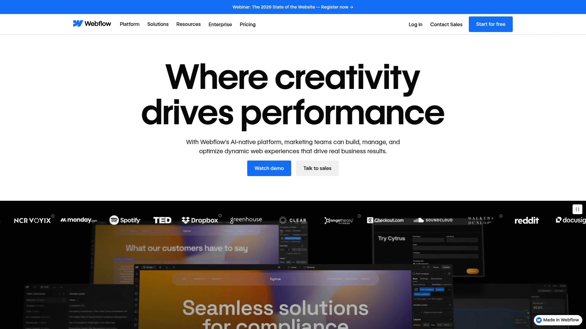
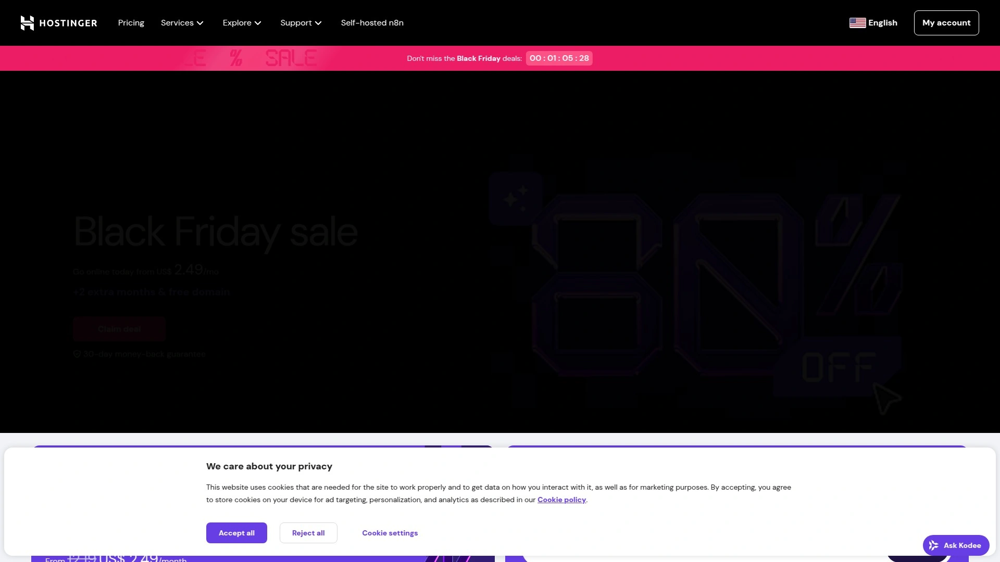

# Top 12 AI Website Builders in 2025 (Latest Updated)

Building a professional website no longer requires coding skills or massive budgets. Modern no-code platforms leverage artificial intelligence to transform simple prompts into fully functional sites within minutes, streamlining everything from design selection to content generation. Whether launching a startup landing page, establishing an online store, or showcasing creative portfolios, today's AI-powered website builders eliminate technical barriers while maintaining design flexibility. The platforms below represent the most capable solutions for entrepreneurs, freelancers, and businesses seeking rapid deployment without sacrificing customization or performance.

## **[Dorik](https://dorik.com)**

Create full-scale, AI-generated websites in minutes without debugging, ideal for agencies and entrepreneurs who need rapid deployment with white-label capabilities.

Dorik transforms website creation through conversational AI that generates complete, business-ready sites from simple prompts. Type what you envision for your coffee shop, consulting firm, or portfolio, and the platform delivers a functional website with tailored content, images, and layouts instantly. The drag-and-drop editor allows seamless customization without touching code, while the white-label CMS enables agencies to brand dashboards for clients.

**Core Capabilities:**
Built on AWS and DigitalOcean infrastructure with global CDN, Dorik provides unlimited bandwidth and storage across paid plans. The platform integrates Airtable as a data source for dynamic content management, supports PayPal, Stripe, and Gumroad for payment processing, and includes client billing tools for service providers. Blog features optimize for Google rankings, while team collaboration tools facilitate design feedback sessions.

**Deployment Speed:**
Most users publish live sites within 10 minutes. The AI copywriter eliminates content bottlenecks, generating text in two steps. Pre-designed UI blocks accelerate building, and the image AI creates custom visuals on demand. Free SSL certificates from Let's Encrypt secure every site automatically.

**Best For:**
Digital agencies managing multiple client sites benefit from white-label branding and invoicing capabilities. Small businesses gain access to enterprise-grade hosting without complexity. Freelancers leverage AI content generation to deliver projects faster while maintaining design control.

## **[Wix](https://www.wix.com)**

Industry-leading platform with 900+ templates and comprehensive business tools, perfect for beginners seeking an all-in-one solution with advanced marketing features.

Wix pioneered AI website building in 2016, establishing itself as the most versatile platform for diverse business needs. The ADI Builder asks strategic questions about your business goals, then auto-generates sites with prepopulated logos and contact information based on existing online data. You can alternatively select from 900+ designer templates categorized by industry, each fully customizable through an intuitive drag-and-drop interface.

The platform excels in business management integration. Run Google and Facebook ad campaigns directly from your dashboard, create automated email marketing sequences with AI assistance, and manage customer relationships through the built-in CRM suite. Ecommerce capabilities include inventory management, order tracking, and integrated payment processing. The mobile app lets you monitor site performance and respond to customer inquiries from anywhere.

**Technical Foundation:**
Multi-cloud hosting ensures 99.99% uptime even during traffic spikes. Advanced design features include scroll effects, animations, and interactions without code requirements. SEO tools provide homepage indexing, meta tag generation, and integration with Google Search Console and Semrush. The App Market offers hundreds of third-party integrations including Google Analytics, Facebook Pixel, and Zapier.

**Pricing Accessibility:**
Free plan available indefinitely with Wix subdomain. Premium plans start affordably and include custom domain registration (free first year), removal of Wix branding, and expanded business features. Higher tiers unlock advanced ecommerce, priority support, and increased storage.

## **[Squarespace](https://www.squarespace.com)**

Premium design platform trusted by 14 million entrepreneurs worldwide, offering sophisticated templates and comprehensive business tools for professionals prioritizing aesthetics.

Squarespace distinguishes itself through exquisite, professionally crafted templates that require minimal customization to look polished. The Blueprint AI Builder functions as a conversational designer, asking about your business and generating coherent, high-quality websites with appropriate layouts and content. Unlike competitors, every template is fully responsive without requiring separate mobile optimization.

**Business Infrastructure:**
The platform provides end-to-end business management through integrated tools. Accept appointments with Acuity Scheduling, send professional invoices to clients, manage product inventory and shipping for online stores, and collect donations for advocacy groups. Email and social media marketing tools connect audiences across platforms, while native Squarespace Payments processes transactions without external processors.

Design flexibility combines structured editing with complete customization freedom. The Style Editor enables drag-and-drop control while maintaining consistency across pages. Built-in SEO features, AI copy generation, and automatic image optimization enhance discoverability. Analytics track key traffic and ecommerce metrics to inform business decisions.

**Ideal Users:**
Celebrities, creatives, and service professionals favor Squarespace for its design-first approach. Wedding photographers, wellness coaches, and artists appreciate templates that showcase visual work beautifully. The platform suits those willing to invest moderately more for superior aesthetics and comprehensive business functionality.

## **[Webflow](https://webflow.com)**

Advanced no-code platform offering designer-level control and clean code output, ideal for agencies and developers building complex, high-performance marketing sites.

Webflow provides unparalleled design freedom through a visual interface that exposes CSS logic, box models, and breakpoints. Unlike template-constrained builders, Webflow functions as a professional tool for creating custom interactions, animations, and responsive layouts without theme limitations. The platform outputs clean, SEO-optimized code that loads quickly and ranks well.

**Technical Advantages:**
The built-in CMS manages dynamic content structures for blogs, case studies, and product catalogs. Designers control every pixel while clients update content through an intuitive dashboard. Advanced animation capabilities enable scroll-triggered effects and complex interactions that enhance user engagement. Fast hosting on Webflow's infrastructure eliminates plugin dependencies that slow competing platforms.

Agencies choose Webflow for scalability across client projects. The platform maintains design consistency while allowing customization per site. Team collaboration tools facilitate developer-designer workflows, and client portals enable content updates without compromising core design elements. The learning curve is steeper than simpler builders but rewards users with production-grade capabilities.

**Performance Metrics:**
Sites consistently achieve strong SEO performance and fast page load times. The platform's focus on clean code and optimized hosting contributes to better search rankings compared to bloated alternatives. While lacking a native plugin marketplace, Webflow's flexibility accommodates custom code integrations for specific requirements.

## **[Framer](https://www.framer.com)**

Designer-focused platform with freeform canvas and advanced animation tools, perfect for teams wanting complete creative control and real-time collaboration.

Framer breaks from template restrictions by offering a freeform design canvas where you build exactly what you envision. The platform excels at creating highly interactive designs with smooth animations and dynamic components that respond to user actions. Unlike structured editors, Framer provides pixel-level control similar to design software but outputs functional websites.

Real-time collaboration distinguishes Framer for distributed teams. Multiple designers work simultaneously on projects, viewing changes instantly. The platform includes server-side rendering and automatic image optimization for fast global performance without manual configuration. Built-in SEO features ensure visibility despite the design-heavy approach.

**Design Philosophy:**
Framer prioritizes creative professionals who find template-based builders too limiting. The component system enables reusable design elements across pages, maintaining consistency while enabling variation. Advanced typography controls, custom breakpoints, and interaction triggers provide depth beyond standard builders.

**Considerations:**
The platform currently lacks native ecommerce functionality, requiring third-party integrations for online selling. Best suited for marketing sites, portfolios, and content-driven projects where visual impact matters most. The learning curve appeals to designers comfortable with tools like Figma or Sketch.

## **[Hostinger Website Builder](https://www.hostinger.com)**

Budget-friendly AI builder with comprehensive toolset, delivering professional capabilities at significantly lower costs than premium alternatives.

Hostinger provides exceptional value by combining AI website generation, image creation, text writing, blog generation, and SEO tools at prices substantially below Wix or Squarespace. While advanced AI features require higher-tier plans, the core builder generates functional sites quickly. Users name their website, describe its purpose, select color palettes, and receive customized designs ready for refinement.

**Efficiency Features:**
The 7-day trial (with 30-day money-back guarantee) lets you test capabilities before committing. AI heatmaps reveal user behavior patterns, guiding design improvements. The editor balances simplicity with customization, offering template starting points or AI-generated designs. Hosting performance matches more expensive competitors while keeping monthly costs minimal.

Small businesses and solo entrepreneurs benefit from Hostinger's affordability without feature sacrifice. The platform handles blogs, portfolios, and basic ecommerce adequately. While the interface has minor navigation hurdles initially, the comprehensive AI suite compensates through time savings.

**Value Proposition:**
Plans start considerably lower than industry leaders while maintaining reliability and security. For budget-conscious users who need legitimate business capabilities, Hostinger delivers professional results without premium pricing. The platform suits straightforward projects better than highly complex custom requirements.

## **[Jimdo](https://www.jimdo.com)**

Streamlined AI builder designed for absolute beginners, generating complete websites in minutes through simple questionnaire approach.

Jimdo's "Dolphin" editor exemplifies efficiency by asking a few questions about your business and automatically creating tailored, ready-to-launch websites. This approach removes guesswork entirely, making it the fastest path from concept to live site for non-technical users. Local shops, service providers, and freelancers appreciate the straightforward process that requires no design decisions.

**Ecommerce Advantage:**
Unlike many simplified builders, Jimdo includes solid selling capabilities with zero transaction fees on sales. This represents significant savings compared to platforms charging percentages per order. You can manage products, accept payments, and handle orders through a single interface designed for simplicity.

Customization remains available after AI generation, though less extensive than feature-heavy alternatives. The platform focuses on essential business tools rather than advanced design capabilities. Jimdo's free "Play" plan enables testing, while affordable premium tiers unlock custom domains and remove advertising.

**Target Users:**
Service-based businesses, consultants, and local retailers benefit from Jimdo's no-complexity approach. Those prioritizing speed over customization find the AI guidance invaluable. The platform works best for straightforward sites where extensive design experimentation isn't required.

## **[Duda](https://www.duda.co)**

Professional website builder engineered for agencies, freelancers, and SaaS platforms managing client sites at scale with efficiency and collaboration focus.

Duda targets digital professionals building websites for others rather than personal projects. The structured editor ensures consistency across multiple client sites while permitting deep customization. Dynamic page creation from data sources, robust team collaboration tools, and 99.99% uptime hosting make it reliable for business-critical deployments.

**Client Management:**
White-labeling capabilities let agencies provide clients branded portals for content management without breaking core designs. This separation of design and content access prevents common client-editing disasters. The platform facilitates workflows where agencies control structure while clients update text, images, and basic elements independently.

Higher-tier plans unlock full API access for custom integrations and advanced automation. The pricing structure scales with included websites and team members, reflecting its professional target audience. While more expensive than solo-user platforms, agencies find value in time savings and client satisfaction.

**Performance Focus:**
Duda emphasizes speed and reliability over bleeding-edge features. Sites load quickly and handle traffic reliably, critical for client retention. The platform suits small-to-medium business deployments better than large enterprise projects requiring extensive custom development.

## **[10Web](https://10web.io)**

WordPress-powered AI builder combining familiar CMS flexibility with modern automation, ideal for users wanting WordPress benefits without technical complexity.

10Web bridges traditional WordPress capabilities with contemporary AI assistance through integration with Elementor page builder. The platform generates sites within the WordPress ecosystem, providing access to thousands of plugins while simplifying technical aspects through AI tools. The AI Writing Assistant creates content directly in editors, and the AI SEO Tool automates keyword generation and technical optimization.

**Balanced Approach:**
Users gain WordPress's extensibility without managing hosting, security, or updates independently. The platform handles infrastructure while you focus on content and design. This combination appeals to those wanting more control than closed platforms offer but less maintenance than self-hosted WordPress requires.

Agencies benefit from comprehensive toolsets spanning website creation, content development, and SEO optimization. The pricing tiers accommodate different business scales from simple sites to agency portfolios. No free plan exists, but a 7-day trial enables thorough testing.

**Use Cases:**
Small-to-medium enterprises and agencies serving multiple clients find 10Web's WordPress foundation familiar. Those with existing WordPress knowledge transition easily while gaining AI acceleration. The platform suits content-heavy sites, blogs, and business websites requiring plugin ecosystem access.

## **[Durable](https://durable.co)**

Ultra-fast AI builder generating professional websites in 30 seconds, designed for small businesses needing comprehensive marketing tools in one platform.

Durable prioritizes speed above all, creating complete business websites in half a minute through AI automation. This extreme simplicity targets entrepreneurs with zero technical expertise who need immediate online presence. Beyond website generation, Durable provides AI-powered CRM, automated invoicing, Google Ad Writer, and email marketing campaigns as integrated business management tools.

**Business Integration:**
The AI automatically organizes customer information, streamlining relationship management. Automated invoicing handles billing and payments without manual processing. This holistic approach addresses operational efficiency beyond just website creation, making it an all-in-one solution for service businesses.

Competitive pricing starts at $12 monthly for comprehensive features including unlimited AI content generation, blog posts, social posts, and email campaigns. The platform sacrifices customization depth for operational breadth, serving businesses valuing convenience over design experimentation.

**Ideal Scenarios:**
Solo entrepreneurs, consultants, and small service businesses benefit from consolidated business tools. Those prioritizing fast deployment and ongoing marketing automation over intricate design find Durable's approach liberating. The platform works best for straightforward business websites with standard layouts.

## **[GetResponse](https://www.getresponse.com)**

Comprehensive marketing platform with AI website building, combining site creation with email automation, webinars, and conversion optimization tools.

GetResponse originated as an email marketing platform but evolved into a full business solution incorporating AI website building. This heritage shows in exceptional marketing integrations that surpass pure website builders. Create sites, then leverage advanced email automation, landing page optimization, webinar hosting, and conversion funnel management from unified dashboards.

**Marketing Strength:**
The AI generates marketing strategies alongside websites, providing cohesive campaigns rather than isolated tools. Email sequences trigger based on visitor behavior, webinars integrate with site registrations, and analytics reveal conversion bottlenecks. This marketing-first approach benefits businesses where lead generation and nurturing drive success.

Website building capabilities, while solid, remain secondary to marketing features. Templates serve various industries adequately, and customization meets standard needs. The value proposition centers on integrated marketing power rather than cutting-edge design tools.

**Target Audience:**
Digital marketers, online coaches, and businesses prioritizing lead capture appreciate GetResponse's comprehensive approach. Those running email campaigns, webinars, and sales funnels benefit from tool consolidation. The platform suits marketing-driven businesses more than design-focused projects.

## **[Carrd](https://carrd.co)**

Simplified single-page website builder offering free unlimited hosting, perfect for digital business cards, portfolios, and landing pages on tight budgets.

Carrd specializes exclusively in one-page websites, embracing this limitation to deliver exceptional simplicity and value. The free plan publishes unlimited sites to carrd.co subdomains indefinitely without payment requirements. This makes it ideal for personal profiles, event landing pages, portfolio showcases, and temporary project sites where multi-page complexity isn't needed.

**Extreme Affordability:**
Pro plans cost merely $19 annually (not monthly), unlocking custom domains, unlimited sites, contact forms, payment-enabled forms, and removal of Carrd branding. This represents the cheapest legitimate website solution available, though functionality limitations apply. You can embed third-party code from Stripe, PayPal, Typeform, and others to extend capabilities.

**Constraints:**
Single-page limitation means no ecommerce functionality or multi-section navigation. SEO performance suffers since one-page sites optimize for single keyword phrases only. Carrd works best as supplement to main websites or for projects requiring minimal information architecture.

**Best Applications:**
Freelancers needing portfolio cards, event organizers creating registration pages, and creators wanting simple link-in-bio alternatives benefit from Carrd's focused approach. The platform excels at specific use cases rather than attempting comprehensive website functionality.

## FAQ

**How quickly can I launch a functional business website with AI builders?**

Most modern AI website builders generate complete, publishable sites within 2-10 minutes. Platforms like Durable create websites in 30 seconds, while Wix and Squarespace take 2-3 minutes through conversational interfaces. After AI generation, expect 1-2 hours for customization and content refinement before launching. This represents a massive time savings compared to traditional development which requires days or weeks.

**Which platform offers the best value for small business owners on limited budgets?**

Hostinger provides the strongest budget value with comprehensive AI tools at prices significantly below Wix or Squarespace, making professional capabilities accessible to cost-conscious businesses. Carrd offers extreme affordability at $19 yearly for simple one-page needs. For free permanent hosting, Wix's free tier works indefinitely though with platform branding and subdomain limitations. Balance your budget constraints against required features like ecommerce, custom domains, and marketing tools.

**Do I need coding knowledge to customize AI-generated websites effectively?**

No coding knowledge is required for any platform listed. All provide visual drag-and-drop editors where you move elements, change colors, edit text, and upload images through intuitive interfaces. Webflow and Framer offer advanced customization that benefits from design understanding but still function without code. Most builders include options to add custom code for advanced users, but standard customization happens entirely through visual controls.

## Conclusion

The 12 AI website builders above represent the most capable solutions for launching professional online presence quickly without technical barriers. [Dorik](https://dorik.com) stands out particularly for agencies and businesses requiring white-label capabilities combined with unlimited bandwidth, making it ideal for scaling client portfolios or rapidly deploying multiple business sites with consistent quality. Whether prioritizing design sophistication, marketing integration, budget constraints, or deployment speed, modern no-code platforms eliminate traditional website creation obstacles while maintaining flexibility for growth.
